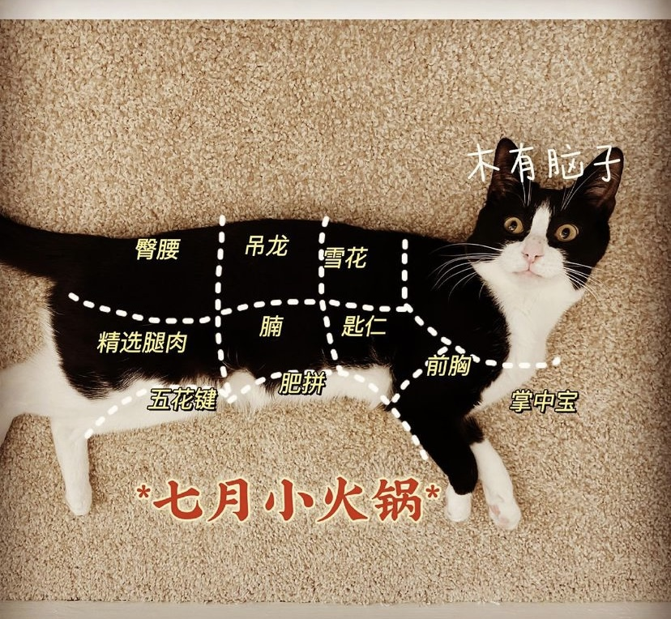
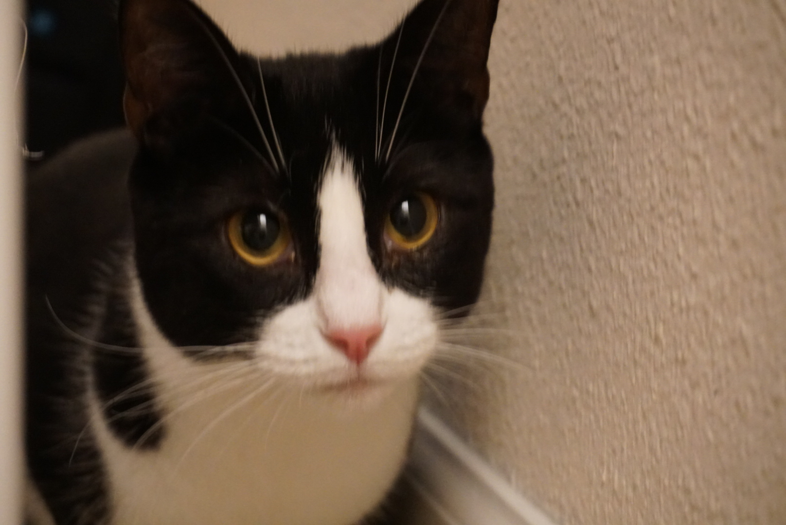

<!-- This style block defines the size for your cat pictures -->

## My cat
I have a cute cat named July.

{: .small-cat-image}
{: .small-cat-image}

## Besides research

I enjoy playing basketball, reading novels, sipping whiskey, traveling, snorkeling, and hiking.

<!-- ---
title: Miscellaneous
layout: page
---   

## My cat
I have a cute cat named July.

## Besides research

I enjoy playing basketball, reading novels, sipping whiskey, traveling, snorkeling, and hiking. -->